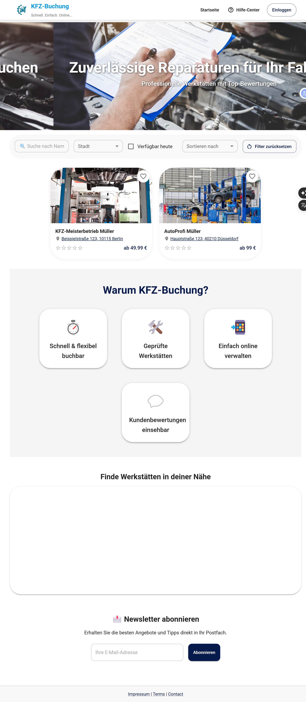
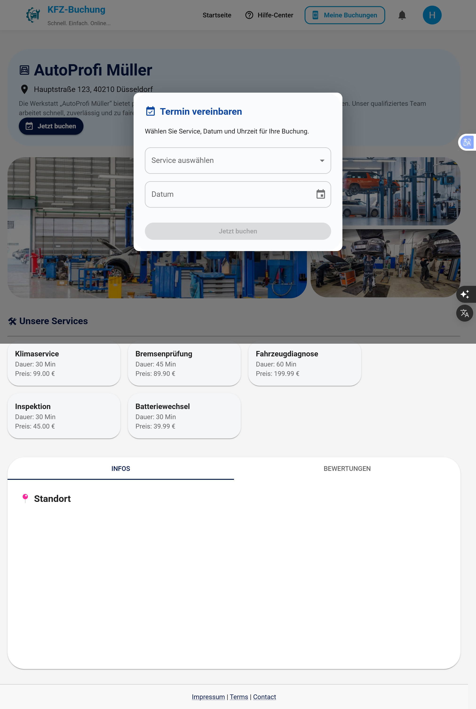
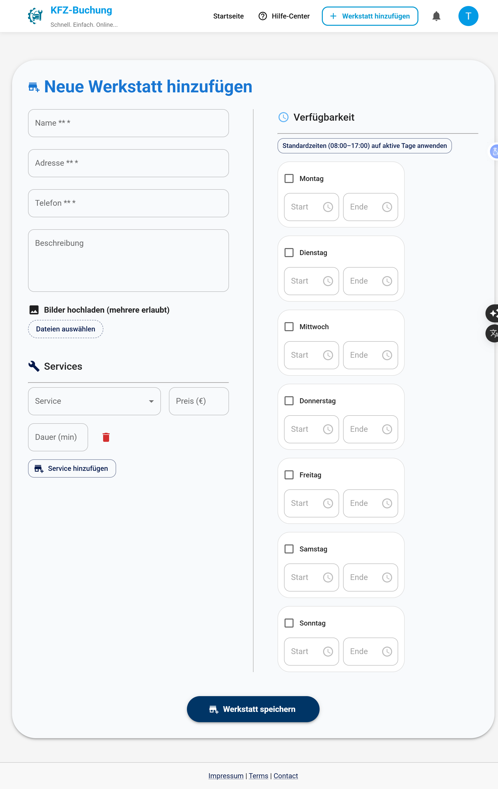
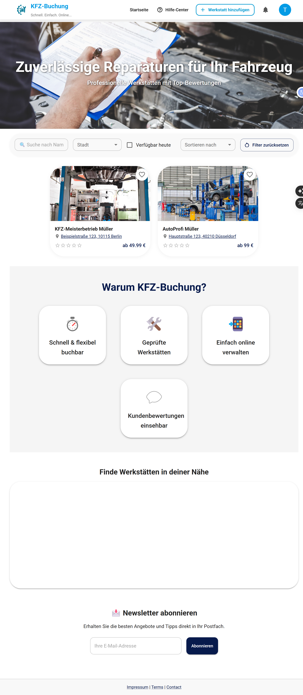

#  KFZ Buchungssystem

A full-stack MERN application for booking car diagnostics and repair services.

---

## 📸 Preview


### 🏠 Homepage


### 👤 Customer Dashboard


### 🛠️ Workshop Creation


### 👨‍🔧 Provider Profile


---

##  Features

### Authentication & Roles
- JWT-based authentication
- Role-based access:
  - Customer
  - Service Provider

### Workshop Management
- Create, update, and delete workshops
- Add services with price and duration
- Manage availability (days and time slots)

### Booking System
- Book available time slots
- Dynamic time slot generation
- Prevent double bookings

### Notifications
- Customers receive updates when bookings are confirmed or cancelled
- Service providers are notified when a new booking is created

### Email System
- Booking confirmation emails using Mailtrap

---

## 🛠️ Tech Stack

### Frontend
- React.js
- React Router
- Context API
- Material UI (MUI)
- Axios

### Backend
- Node.js
- Express.js
- MongoDB Atlas
- Mongoose
- JWT Authentication

---

## 📁 Project Structure
KFZ-Buchungssystem/
├── client/
├── Server/
├── screenshots/
└── README.md

---

## ⚙️ Installation

### Backend

```bash
cd Server
npm install
npm start
Frontend
cd client
npm install
npm run dev

 #### API Configuration
const API_URL = import.meta.env.VITE_API_URL || "http://localhost:5000";

⚠️ Notes
This project is still under development.
Some features and UI improvements are ongoing.


Author

Hanaa Ouerghi
Fullstack Developer (React / Node.js)